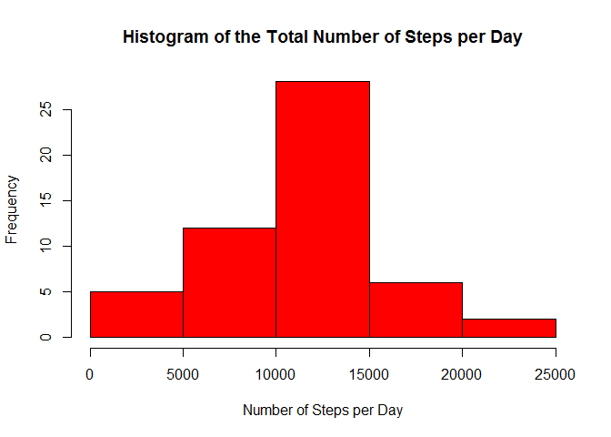
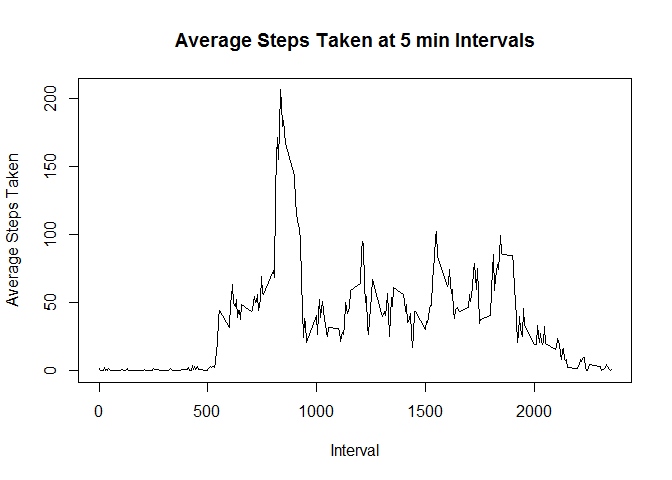
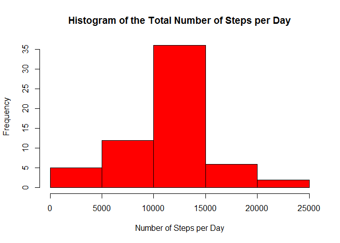
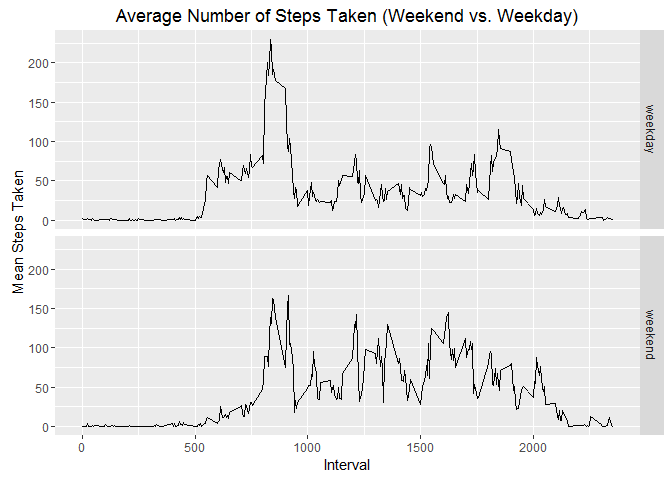

# Reproducible Research: Peer Assessment 1


Loading and preprocessing the data, read the data to R

```
## Warning: package 'dplyr' was built under R version 3.2.5
```

```
## 
## Attaching package: 'dplyr'
```

```
## The following objects are masked from 'package:stats':
## 
##     filter, lag
```

```
## The following objects are masked from 'package:base':
## 
##     intersect, setdiff, setequal, union
```

What is mean total number of steps taken per day?
1. Calculate total steps per day

```r
steps_day <- true_walk %>%
  group_by(date) %>%
  summarize(steps_total = sum(steps))
```
2. Make a histogram of the total steps per day

```r
summary(steps_day)
```

```
##          date     steps_total   
##  2012-10-02: 1   Min.   :   41  
##  2012-10-03: 1   1st Qu.: 8841  
##  2012-10-04: 1   Median :10765  
##  2012-10-05: 1   Mean   :10766  
##  2012-10-06: 1   3rd Qu.:13294  
##  2012-10-07: 1   Max.   :21194  
##  (Other)   :47
```

```r
hist(steps_day$steps_total, 
     xlab="Number of Steps per Day", 
     main = "Histogram of the Total Number of Steps per Day", 
     col=2)
```

<!-- -->
3.  Calculate and report the mean and median of the total number of steps taken per day

```r
mean_steps <- mean(steps_day$steps_total)
med_steps <- median(steps_day$steps_total)
```
```
mean_steps = 10766.19
median steps = 10765
```
What is the average daily activity pattern
1.  Make a time series plot (i.e. type = "l") of the 5-minute interval (x-axis) 
    and the average number of steps taken, averaged across all days (y-axis)
    

```r
steps_fivemin <- true_walk %>%
       group_by(interval) %>%
       summarize(steps_Ave5 = mean(steps))

plot(steps_fivemin$interval, steps_fivemin$steps_Ave5, 
     type = "l",
     main = "Average Steps Taken at 5 min Intervals",
     ylab = "Average Steps Taken", 
     xlab = "Interval", 
     )
```

<!-- -->

2. Which 5-minute interval, on average across all the days in the 
   dataset, contains the maximum number of steps?
   

```r
maxSteps <- steps_fivemin$interval[which.max(steps_fivemin$steps_Ave5)]
```
```
maximum number of steps is 835
```
Imputing missing values
1.  Calculate and report the total number of missing values in 
    the dataset (i.e. the total number of rows with NAs)
    

```r
missValues <- sum(is.na(walk$steps))
```
```
Total number of missing values is 2304
```

2.  Devise a strategy for filling in all of the missing values 
    in the dataset. The strategy does not need to be sophisticated. 
    For example, you could use the mean/median for that day, or the 
    mean for that 5-minute interval, etc.
3.  Create a new dataset that is equal to the original dataset 
    but with the missing data filled in.
    

```r
fillValues <- walk
for (i in 1:nrow(fillValues)) {
    if (is.na(fillValues$steps[i])) {
      indValues <- which(fillValues$interval[i] == steps_fivemin$interval)
      fillValues$steps[i] <- steps_fivemin[indValues,]$steps_Ave5
    }
}

fillValues$date <- as.Date(fillValues$date)
```

4.  Make a histogram of the total number of steps 
    taken each day and Calculate and report the mean 
    and median total number of steps taken per day. 
    Do these values differ from the estimates from the 
    first part of the assignment? What is the impact 
    of imputing missing data on the estimates of the 
    total daily number of steps? 

The rest is basically the same process as above.

```r
fillSteps_day <- fillValues %>%
  group_by(date) %>%
  summarize(steps_total = sum(steps))
```
Make a histogram of total number of steps per day


```r
summary(fillSteps_day)
```

```
##       date             steps_total   
##  Min.   :2012-10-01   Min.   :   41  
##  1st Qu.:2012-10-16   1st Qu.: 9819  
##  Median :2012-10-31   Median :10766  
##  Mean   :2012-10-31   Mean   :10766  
##  3rd Qu.:2012-11-15   3rd Qu.:12811  
##  Max.   :2012-11-30   Max.   :21194
```

```r
hist(fillSteps_day$steps_total,
     xlab="Number of Steps per Day", 
     main = "Histogram of the Total Number of Steps per Day", 
     col=2)
```

<!-- -->

Calculate the mean and the median


```r
mean_fillSteps <- mean(fillSteps_day$steps_total)
med_fillSteps <- median(fillSteps_day$steps_total)
```
```
The mean stayed the same as in the previous (both means were 10766.19).  Once the NA values were filled in, it seems that the median was pushed to the center and thus went from 10765 to 10766.19; thus making the mean equal to median.
```
Are there differences in activity patterns between weekdays and weekends?
1.  Create a new factor variable in the 
    dataset with two levels – “weekday” and 
    “weekend” indicating whether a given date 
    is a weekday or weekend day.
    

```r
fillValues$wkDay <- weekdays(fillValues$date)
fillValues$d_type <- "weekday"
fillValues$d_type[fillValues$wkDay %in% c("Saturday", "Sunday")] <- "weekend"

aveDay <- fillValues %>%
  group_by(d_type, interval) %>%
  summarize(steps_Ave5 = mean(steps))
```

2.  Make a panel plot containing a time series 
    plot (i.e. type = "l") of the 5-minute interval 
    (x-axis) and the average number of steps taken, 
    averaged across all weekday days or weekend days (y-axis). 
    See the README file in the GitHub repository to see 
    an example of what this plot should 
    look like using simulated data.
    Using qplot to plot these lines
    

```r
library(ggplot2)
```

```
## Warning: package 'ggplot2' was built under R version 3.2.5
```

```r
qplot(interval, steps_Ave5, data=aveDay,
      xlab = "Interval",
      ylab = "Mean Steps Taken",
      main = "Average Number of Steps Taken (Weekend vs. Weekday)",
      geom = "line",
      facets = d_type~.)
```

<!-- -->
